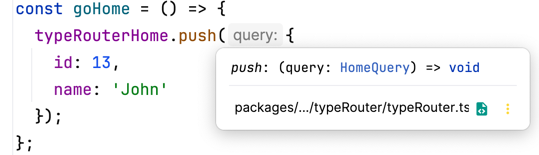
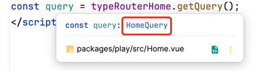

# vue-typesafe-router

The easiest way to define typesafe router in Vue.

## Usage

```bash
npm i vue-typesafe-router
or
pnpm i vue-typesafe-router
```

### Use the plugin in your `main.ts`

```ts
import { typeRouterPlugin } from "vue-typesafe-router";

createApp(App).use(typeRouterPlugin).mount("#app");
```

### Define your type safe router

For example, we want to define a `home` route with query data.

```ts
type HomeQuery = {
  id: number;
  name?: string;
};
```

```ts
// router.ts
import { createTypeRoute } from "vue-typesafe-router";

import Detail from "./Detail.vue";
import Home from "./Home.vue";

type HomeQuery = {
  id: number;
  name?: string;
};

export const homeRoute = createTypeRoute<HomeQuery>({
  path: "/home",
  component: Home,
});

const routes = [
  {
    path: "/",
    component: Home,
  },
  homeRoute.config,
  { path: "/detail", component: Detail },
];

export const router = createRouter({
  history: createWebHashHistory(),
  routes: routes,
});
```

### Pass route query data with full typesafe

```vue
<!--Detail.vue-->

<template>
  <h1>Hello detail!</h1>
  <button @click="goHome">Go Home</button>
</template>

<script setup lang="ts">
import { homeRoute } from "./router.ts";
const goHome = () => {
  homeRoute.push({
    id: 1,
    name: "John",
  });
};
</script>
```

Now, You can pass route query data with full type safe!



### Get route query data with full typesafe

```vue
<!--Home.vue-->
<template>
  <h1>Hello home! {{ query }}</h1>
</template>

<script setup lang="ts">
import { homeRoute } from "./router.ts";
const query = homeRoute.getQuery();
</script>
```

Now, You can get query data with full typesafe!

