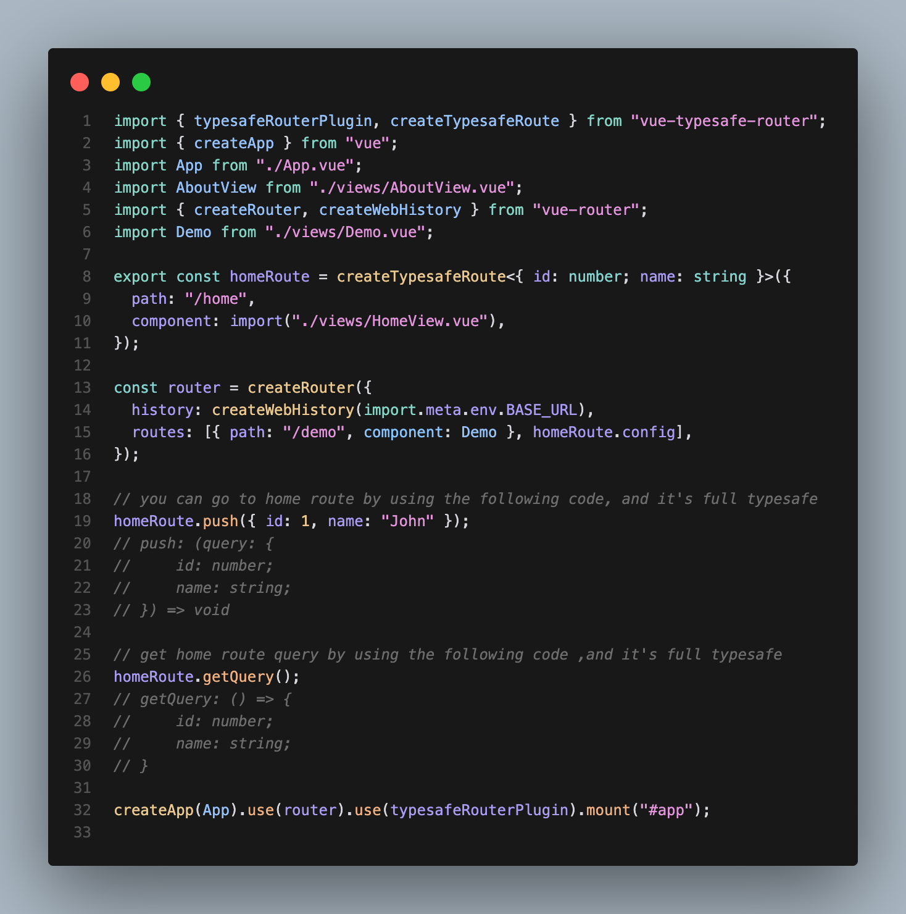

# vue-typesafe-router

[中文文档](./README.zh-CN.md) | [English](./README.md)

最简单的在 Vue3 中定义类型安全路由的方式。只需 2 个 api 即可定义你的类型安全路由


## 安装

```bash
npm i vue-typesafe-router
or
pnpm i vue-typesafe-router
```

## 使用方法

### 1. 在 app 中使用 typesafeRouterPlugin

```ts
import { typesafeRouterPlugin } from "vue-typesafe-router";
import { createApp } from "vue";

createApp(App).use(typesafeRouterPlugin);
```

### 2. 定义你的路由

```ts
import { typesafeRouterPlugin, createTypesafeRoute } from "vue-typesafe-router";
import { createRouter, createWebHistory } from "vue-router";

export const homeRoute = createTypesafeRoute<{ id: number; name: string }>({
  path: "/home",
  component: import("./Home.vue"),
});

const router = createRouter({
  history: createWebHistory(),
  routes: [
    // 使用 homeRoute.config 作为路由之一
    homeRoute.config,
    // 你也可以添加普通的路由
    { path: "/demo", component: Demo },
  ],
});
```

### 3. 在 组件 中使用 route 导航和 query，它是完全类型安全的，push 和 getQuery 会自动推断类型

```ts
import { homeRoute } from "./your-routes";
// 导航到 home 路由
homeRoute.push({ id: 1, name: "home" });

// 从 home 路由中获取 query
homeRoute.getQuery();
```
